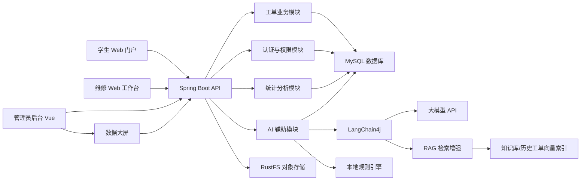
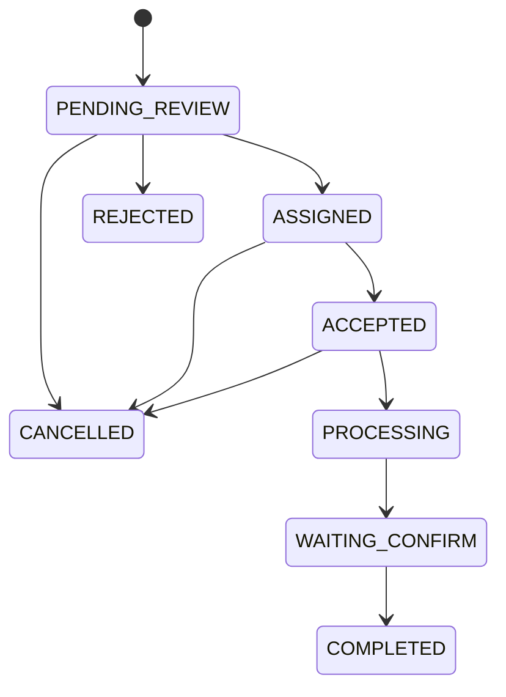

# 系统规划与概要设计

## 一、总体设计目标

系统采用前后端分离架构，面向学生、维修人员和管理员提供不同 Web 端能力。后端提供统一 RESTful API，前端使用 Vue 技术栈实现学生门户、维修工作台、管理员后台和数据大屏。数据库负责持久化业务数据，RustFS 负责存储报修图片和维修结果图片，AI 模块基于 LangChain4j 对外部大模型 API、RAG 检索增强生成和本地规则引擎进行封装。

总体目标是实现“学生在线报修、后台高效派单、维修端闭环处理、AI 辅助提效、数据统计支撑管理”的校园智能报修服务平台。

## 二、技术选型

| 层次 | 技术 | 说明 |
| --- | --- | --- |
| 前端 | Vue / Element Plus / ECharts | 实现学生门户、维修工作台、管理员后台、数据大屏、表格、表单和统计图表 |
| 后端 | Spring Boot | 提供业务接口、权限控制、文件上传和 AI 调用封装 |
| 数据库 | MySQL | 存储用户、工单、分类、评价、公告等业务数据 |
| ORM | MyBatis Plus / MyBatis | 简化数据访问层开发 |
| 权限认证 | JWT / Sa-Token / Spring Security | 实现角色权限控制 |
| 文件存储 | RustFS 对象存储 | 保存报修图片、维修结果图片等非结构化文件 |
| AI 能力 | LangChain4j + 大模型 API + RAG + 关键词规则 | 分类、摘要、优先级判断、知识库问答、提示词编排、检索增强生成、结果解析和兜底 |
| 向量检索 | LangChain4j EmbeddingStore / 数据库向量索引 | 存储维修知识库、历史工单摘要和公告规范的向量化片段 |
| 日志 | SLF4J + Logback | 记录运行日志、异常栈和关键业务上下文 |

## 三、系统架构

## 四、模块划分

### 1. 用户与权限模块

负责学生、维修人员、管理员的登录认证、角色识别和权限校验。不同角色只能访问对应接口和数据范围。

核心能力：

- 用户登录与退出。
- Token 签发和校验。
- 角色权限控制。
- 用户信息维护。

### 2. 工单管理模块

负责报修工单的创建、审核、派单、接单、处理、完成、取消和评价，是系统核心模块。

核心能力：

- 学生提交报修工单。
- 管理员审核并派单。
- 维修人员接单和更新状态。
- 工单状态流转记录。
- 学生评价维修结果。

### 3. 分类与人员配置模块

负责维护维修分类、维修部门、维修人员和分类匹配关系。

核心能力：

- 维修分类增删改查。
- 分类关键词配置。
- 维修人员所属部门管理。
- 维修人员可处理分类配置。

### 4. AI 辅助模块

负责对工单描述进行智能分析，并返回辅助结果。

核心能力：

- 故障类型分类。
- 工单摘要生成。
- 紧急程度判断。
- 相似工单匹配。
- RAG 知识库问答。
- 维修知识库、历史工单和公告规范的向量化检索。
- AI 调用日志和异常运行日志。

### 5. 公告模块

负责发布校园维修通知、停水停电通知、系统公告等信息。

核心能力：

- 管理员发布公告。
- 学生和维修人员查看公告。
- 公告启用、停用和置顶。

### 6. 统计分析模块

负责为管理员提供多维度统计数据，并为数据大屏提供聚合指标接口。

核心能力：

- 按时间统计报修数量。
- 按分类统计故障类型。
- 按地点统计高频故障区域。
- 统计平均处理时长。
- 统计维修人员工作量和完成率。
- 统计学生评价满意度。
- 数据大屏展示工单总数、今日新增、待处理数量、超时工单、分类占比、地点热度、维修人员工作量排行等指标。

## 五、核心状态设计

工单状态建议设计如下：

| 状态编码 | 状态名称 | 说明 |
| --- | --- | --- |
| DRAFT | 草稿 | 学生填写中，可选 |
| PENDING_REVIEW | 待审核 | 学生已提交，等待管理员审核 |
| ASSIGNED | 已派单 | 管理员已分配维修人员 |
| ACCEPTED | 已接单 | 维修人员已确认接单 |
| PROCESSING | 处理中 | 维修人员正在处理 |
| WAITING_CONFIRM | 待确认 | 维修人员已提交处理结果，等待学生确认或评价 |
| COMPLETED | 已完成 | 工单闭环完成 |
| CANCELLED | 已取消 | 学生或管理员取消 |
| REJECTED | 已驳回 | 管理员审核不通过 |

状态流转建议：

## 六、核心数据库表规划

第一阶段建议规划以下表：

| 表名 | 用途 |
| --- | --- |
| sys_user | 用户基础信息 |
| repair_ticket | 报修工单主表 |
| repair_ticket_image | 工单图片表 |
| repair_ticket_flow | 工单状态流转记录 |
| repair_category | 维修分类表 |
| repair_worker_profile | 维修人员扩展信息 |
| repair_assignment | 工单派单记录 |
| repair_evaluation | 维修评价表 |
| campus_location | 校园地点表 |
| notice | 公告表 |
| ai_call_log | AI 调用业务留痕表 |
| knowledge_item | 维修知识库条目表 |
| knowledge_chunk | RAG 知识片段表 |
| knowledge_embedding | 知识片段向量索引表或向量存储映射表 |

说明：如果后续需要建表或插入测试数据，应统一写入 SQL 文件，并明确执行顺序，由用户手动执行。

## 七、接口规划

### 1. 学生端接口

| 接口 | 方法 | 说明 |
| --- | --- | --- |
| /api/student/tickets | POST | 提交报修 |
| /api/student/tickets | GET | 查询我的工单 |
| /api/student/tickets/{id} | GET | 查看工单详情 |
| /api/student/tickets/{id}/cancel | POST | 取消报修 |
| /api/student/tickets/{id}/evaluation | POST | 提交评价 |
| /api/student/ai/precheck | POST | 报修前 AI 预分析 |
| /api/student/ai/knowledge-answer | POST | RAG 知识库问答 |

### 2. 维修端接口

| 接口 | 方法 | 说明 |
| --- | --- | --- |
| /api/worker/tickets | GET | 查询分配给我的工单 |
| /api/worker/tickets/{id}/accept | POST | 接单 |
| /api/worker/tickets/{id}/status | POST | 更新状态 |
| /api/worker/tickets/{id}/result | POST | 提交维修结果 |

### 3. 管理端接口

| 接口 | 方法 | 说明 |
| --- | --- | --- |
| /api/admin/tickets | GET | 工单列表 |
| /api/admin/tickets/{id}/review | POST | 审核工单 |
| /api/admin/tickets/{id}/assign | POST | 派单 |
| /api/admin/categories | GET/POST/PUT/DELETE | 分类管理 |
| /api/admin/workers | GET/POST/PUT/DELETE | 维修人员管理 |
| /api/admin/notices | GET/POST/PUT/DELETE | 公告管理 |
| /api/admin/stats/overview | GET | 统计概览 |
| /api/admin/stats/screen | GET | 数据大屏聚合指标 |
| /api/admin/ai-logs | GET | AI 调用记录 |
| /api/admin/knowledge | GET/POST/PUT/DELETE | 维修知识库管理 |
| /api/admin/knowledge/rebuild-index | POST | 重建 RAG 知识库向量索引 |

## 八、开发优先级

第一阶段必须完成：

- 用户登录与角色区分。
- 学生提交报修。
- 管理员审核和派单。
- 维修人员接单与处理。
- 学生评价。
- 基础分类管理。
- AI 分类、摘要、优先级建议。

第二阶段增强功能：

- 相似工单推荐。
- RAG 知识库问答。
- 公告管理。
- 统计分析。
- 数据大屏展示页。
- 图片多文件管理。

第三阶段优化功能：

- 派单策略优化。
- AI 提示词管理。
- AI 结果人工修正后的反馈学习。
- 更细粒度的数据看板。
