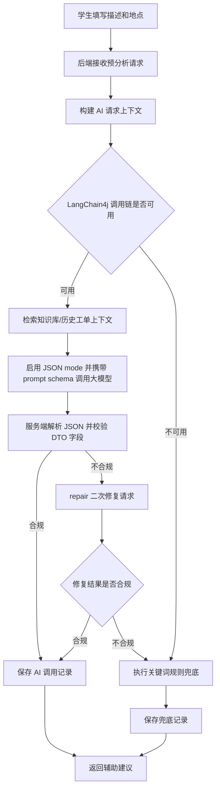
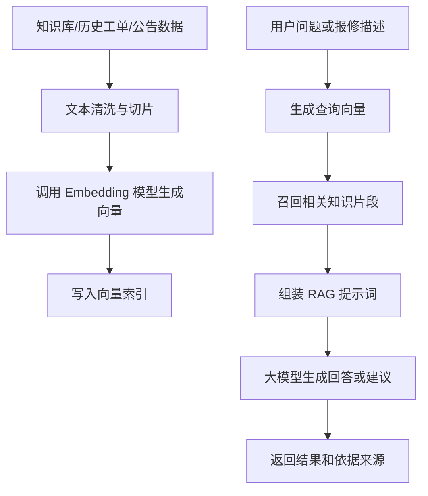

# AI 模块设计方案

## 一、设计原则

AI 模块定位为“辅助决策工具”，不直接替代管理员和维修人员的最终判断。系统中的分类、优先级、摘要、派单建议和知识库回答都应允许人工修改或关闭，并保留最终处理记录。后端 AI 能力基于 LangChain4j 封装，统一管理模型调用、提示词模板、RAG 检索增强生成、结构化输出解析和异常兜底。

AI 模块设计遵循以下原则：

- AI 结果只作为建议，不作为不可修改的系统结论。
- RAG 回答必须基于维修知识库、历史工单或公告规范等可追溯资料，不能让大模型凭空生成维修结论。
- AI 调用失败不能影响报修主流程。
- 必须提供关键词规则兜底方案，保证答辩和离线演示可用。
- AI 调用、RAG 检索、异常、兜底和降级必须写应用运行日志。
- AI 调用记录表用于业务留痕，不能替代运行日志。

## 二、AI 赋能场景

### 1. 故障类型智能分类

根据学生填写的故障描述和地点信息，自动判断工单分类。例如：

| 用户描述 | AI 分类建议 |
| --- | --- |
| 宿舍水龙头一直漏水 | 水电维修 |
| 教室投影没信号 | 多媒体设备 |
| 实验室网络断开 | 网络维修 |
| 门锁打不开 | 门窗门锁 |
| 空调不制冷 | 空调维修 |

### 2. 工单摘要生成

将口语化描述整理成标准工单摘要，并以 JSON DTO 返回，便于前端展示、后端校验和后续入库。摘要生成同样不能只依赖 prompt 约束，而是走 JSON mode、prompt schema、服务端解析校验、repair 二次修复和规则兜底链路。

输入：

```text
3号宿舍楼502卫生间水龙头一直滴水，晚上声音很大，影响休息。
```

输出：

```json
{
  "summary": "3号宿舍楼502卫生间水龙头持续滴水，夜间噪声影响学生休息。",
  "locationText": "3号宿舍楼502卫生间",
  "problem": "水龙头持续滴水",
  "impact": "夜间产生噪声，影响学生休息",
  "needsReview": false
}
```

服务端校验要求：

- `summary` 必填，建议控制在 80 字以内。
- `locationText`、`problem`、`impact` 可为空字符串，但字段必须存在。
- `needsReview` 为布尔值；当描述缺少地点、问题不明确或模型只能推测时必须为 `true`。
- JSON 解析失败、字段缺失、类型错误或摘要超长时，先触发 repair；repair 仍失败则按规则模板生成摘要并记录运行日志。

### 3. 紧急程度判断

根据故障类型和危险关键词判断优先级。

高优先级关键词示例：

- 漏电
- 冒烟
- 起火
- 大面积断水
- 大面积停电
- 电线裸露
- 人员被困

中优先级关键词示例：

- 漏水
- 无法上网
- 空调故障
- 照明损坏
- 投影无法使用

低优先级关键词示例：

- 轻微异响
- 桌椅松动
- 墙面破损
- 非紧急设备异常

### 4. 相似工单推荐

系统在学生提交前检索同一地点或相近地点的未完成工单，如果问题类型和描述相似，则提示可能已有相关工单。

匹配因素：

- 地点相同或相近。
- 分类相同。
- 描述关键词重合。
- 工单状态未完成。
- 提交时间较近。
- RAG 检索召回历史相似工单。

### 5. RAG 维修知识库问答

针对简单问题，系统可先从维修知识库、历史维修结果和公告规范中检索相关片段，再由大模型整理为自助建议。例如：

| 问题 | 自助建议 |
| --- | --- |
| 路由器无法上网 | 检查电源、重启路由器、确认网线连接 |
| 投影无信号 | 检查输入源、重新插拔 HDMI、重启电脑 |
| 空调遥控无反应 | 检查电池、确认空调电源、尝试手动开关 |

RAG 回答应返回依据来源，例如知识库条目标题、历史工单编号或公告标题，便于管理员审核和答辩展示。

## 三、AI 调用流程



## 四、LangChain4j 集成规划

LangChain4j 位于业务服务和大模型 API 之间，主要承担以下职责：

- 统一封装模型客户端，避免业务代码直接依赖具体模型厂商接口。
- 管理分类、摘要、优先级判断、RAG 知识库问答等提示词模板。
- 通过 RAG 组件检索维修知识库、历史工单摘要和公告规范，为大模型回答提供上下文。
- 将模型返回内容解析为结构化 DTO，例如分类、优先级、摘要、判断原因和引用来源。
- 对支持 JSON mode 的模型调用启用 JSON 输出模式，从模型接口层约束返回形态。
- 在提示词中同步声明字段 schema、枚举范围、必填字段和禁止额外字段等约束。
- 对模型返回内容执行服务端 JSON 解析、DTO 反序列化和业务字段校验。
- 当首次返回不可解析或字段不合法时，触发 repair 二次修复；修复仍失败才进入规则兜底。
- 对模型调用设置超时、重试和异常捕获策略。
- 在模型不可用、RAG 检索失败或返回格式不合法时，触发关键词规则兜底。
- 配合 AI 调用记录表保存业务留痕，并配合运行日志记录真实异常栈。

## 五、RAG 检索增强设计

RAG 用于增强维修知识库问答和相似工单辅助，避免大模型脱离系统数据进行空泛回答。

### 1. 数据来源

| 来源 | 内容 | 用途 |
| --- | --- | --- |
| 维修知识库 | 常见故障、处理建议、安全提示 | 自助问答和维修建议 |
| 历史工单 | 故障描述、最终分类、处理结果、评价 | 相似故障参考和重复报修识别 |
| 公告规范 | 停水停电通知、网络维护公告、报修规则 | 避免对已公告问题重复解释 |
| 分类配置 | 分类名称、关键词、负责部门 | 辅助分类和派单建议 |

### 2. 处理流程



### 3. 检索策略

- 优先检索启用状态的维修知识库条目。
- 对相似工单检索，只召回未完成工单或近期已完成工单。
- 检索结果需要包含来源类型和来源主键，例如 `knowledgeItemId`、`ticketId`、`noticeId`。
- 如果召回结果为空，系统不应让大模型编造知识，应返回“未找到明确知识库依据，可提交报修等待人工处理”。
- 高风险问题如漏电、冒烟、起火、人员被困等，应优先返回安全提示和紧急报修建议。

### 4. 存储设计建议

| 表或存储 | 说明 |
| --- | --- |
| knowledge_item | 管理员维护的知识库原始条目 |
| knowledge_chunk | 切片后的知识片段，记录来源类型和来源主键 |
| knowledge_embedding | 向量索引表或向量存储映射，记录 chunkId 与向量标识 |
| ai_call_log | 记录 RAG 查询、召回数量、输出结果和是否兜底 |

如果数据库不方便直接存储向量，可先使用 LangChain4j 支持的内存或文件型 EmbeddingStore 完成毕业设计演示；后续再扩展为支持向量索引的数据库或专用向量库。

## 六、结构化 JSON 输出稳定性设计

AI 分析结果仍然使用 JSON 格式输出，但不能只依赖一句“请输出 JSON”的提示词来保证稳定性。系统采用“JSON mode 限制输出形态 + prompt schema 约束 + 服务端解析校验 + repair 二次修复 + 指标/日志/fallback”的组合方案，保证分类、优先级、摘要和 RAG 回答等结构化结果可解析、可验证、可观测、可兜底。

### 1. JSON mode 限制输出形态

调用支持结构化输出的大模型时，模型客户端必须优先启用 JSON mode 或等价能力，要求模型响应体只能是 JSON 对象，不允许返回 Markdown、解释性文字或代码块。JSON mode 只负责限制输出形态，不能替代业务字段校验。

### 2. prompt schema 约束

提示词中必须明确声明输出 schema，包括：

- 顶层必须是 JSON object。
- 必填字段，例如 `category`、`priority`、`summary`、`reason`。
- 枚举字段，例如 `priority` 只能是 `HIGH`、`MEDIUM`、`LOW`。
- 字符串长度建议，例如 `summary` 控制在 80 字以内，`reason` 控制在 120 字以内。
- 数组元素结构，例如 RAG `sources` 中的 `sourceType`、`sourceId`、`title`。
- 禁止输出 schema 外字段，避免前端和持久化逻辑依赖不稳定字段。

### 3. 服务端解析校验

模型返回后，后端必须先用 JSON 解析器解析原始文本，再反序列化到固定 DTO，并进行业务校验：

- JSON 语法必须合法。
- 必填字段不能为空。
- 枚举值必须在允许范围内。
- 分类必须落在系统分类配置或允许的“其他”兜底分类中。
- RAG 来源必须包含来源类型和来源主键；检索为空时不得伪造来源。
- 文本长度、危险等级和高风险关键词规则必须符合系统约束。

解析失败、反序列化失败和业务校验失败都视为结构化输出失败，不能直接把原始模型文本返回给前端。

### 4. repair 二次修复

首次模型返回不合法时，系统最多发起一次 repair 请求。repair 请求只传入原始输出、目标 schema 和校验错误列表，要求模型把内容修复成合法 JSON，不重新发散生成业务结论。repair 结果仍需走同一套服务端解析和校验。

如果 repair 成功，`ai_call_log` 记录 `repaired=true`、原始错误原因和最终合法结果；如果 repair 失败，进入关键词规则兜底，并记录 `fallbackReason=JSON_PARSE_FAILED`、`SCHEMA_VALIDATE_FAILED` 或对应错误码。

### 5. 指标、日志与 fallback

AI 结构化输出链路需要记录以下指标，便于后续定位“接口降级了但日志看不到原因”的问题：

- `ai_call_total`：AI 调用总数。
- `ai_json_parse_failed_total`：JSON 解析失败次数。
- `ai_schema_validate_failed_total`：schema 校验失败次数。
- `ai_repair_attempt_total`：repair 尝试次数。
- `ai_repair_success_total`：repair 成功次数。
- `ai_fallback_total`：最终走规则兜底次数。

任何解析失败、校验失败、repair 失败和兜底返回都必须写应用运行日志，日志至少包含业务场景、`ticketId`/`studentId`/`aiCallLogId`/`knowledgeItemId` 等上下文标识、校验错误摘要和真实异常信息。未预期异常或第三方依赖失败优先使用 `log.error(..., exception)` 保留完整堆栈。

## 七、JSON Schema 与提示词设计

### 1. 分类与摘要提示词

```text
你是校园后勤报修系统的工单辅助分析助手。
当前调用已启用 JSON mode。请根据学生提交的报修信息，只输出一个 JSON object，不要输出 Markdown、代码块或额外解释。

可选分类：
- 水电维修
- 网络维修
- 多媒体设备
- 空调维修
- 门窗门锁
- 桌椅家具
- 环境卫生
- 其他

优先级只能是 HIGH、MEDIUM、LOW。

判断规则：
1. 涉及漏电、冒烟、起火、电线裸露、大面积停水停电等危险或影响范围大的问题，优先级为 HIGH。
2. 涉及漏水、网络不可用、教学设备不可用、空调无法使用等影响正常学习生活的问题，优先级为 MEDIUM。
3. 轻微损坏、不影响使用或可延后处理的问题，优先级为 LOW。
4. 如果信息不足，分类为“其他”，优先级为 LOW，并在 reason 中说明信息不足。

输入字段：
地点：{{location}}
故障描述：{{description}}

输出 schema：
{
  "type": "object",
  "required": ["category", "priority", "summary", "reason"],
  "additionalProperties": false,
  "properties": {
    "category": {
      "type": "string",
      "enum": ["水电维修", "网络维修", "多媒体设备", "空调维修", "门窗门锁", "桌椅家具", "环境卫生", "其他"]
    },
    "priority": {
      "type": "string",
      "enum": ["HIGH", "MEDIUM", "LOW"]
    },
    "summary": {
      "type": "string",
      "description": "标准工单摘要，建议 80 字以内"
    },
    "reason": {
      "type": "string",
      "description": "简短判断依据，建议 120 字以内"
    }
  }
}
```

### 2. RAG 知识库问答提示词

```text
你是校园后勤自助维修建议助手。
当前调用已启用 JSON mode。最终只能输出一个 JSON object，不要输出 Markdown、代码块或额外解释。
请严格根据检索到的知识库内容、历史工单和公告信息，给出安全、简短、可操作的建议。
如果检索内容不足，请说明“知识库中未找到明确依据”，不要编造维修结论。
如果问题涉及漏电、冒烟、起火、人员被困或高风险设备，请不要指导用户自行维修，应提示立即停止使用并提交紧急报修。

用户问题：{{question}}
检索内容：{{retrievedContext}}

输出 schema：
{
  "type": "object",
  "required": ["answer", "riskLevel", "sources"],
  "additionalProperties": false,
  "properties": {
    "answer": {
      "type": "string",
      "description": "自助建议，必须基于检索内容；检索不足时说明未找到明确依据"
    },
    "riskLevel": {
      "type": "string",
      "enum": ["HIGH", "MEDIUM", "LOW"]
    },
    "sources": {
      "type": "array",
      "items": {
        "type": "object",
        "required": ["sourceType", "sourceId", "title"],
        "additionalProperties": false,
        "properties": {
          "sourceType": {
            "type": "string",
            "enum": ["KNOWLEDGE", "TICKET", "NOTICE"]
          },
          "sourceId": {
            "type": "string"
          },
          "title": {
            "type": "string"
          }
        }
      }
    }
  }
}
```

## 八、规则兜底方案

当大模型 API 不可用、RAG 检索失败、超时、返回格式错误或网络异常时，系统启用本地规则。

### 1. 分类规则示例

| 关键词 | 分类 |
| --- | --- |
| 水龙头、水管、漏水、下水道、厕所、断水 | 水电维修 |
| 电、灯、插座、跳闸、漏电、冒烟 | 水电维修 |
| 网络、网线、WiFi、路由器、校园网 | 网络维修 |
| 投影、幕布、电脑、音响、麦克风 | 多媒体设备 |
| 空调、不制冷、不制热、遥控器 | 空调维修 |
| 门、锁、窗、玻璃、钥匙 | 门窗门锁 |
| 桌、椅、床、柜子 | 桌椅家具 |

### 2. 优先级规则示例

| 关键词 | 优先级 |
| --- | --- |
| 漏电、冒烟、起火、电线裸露、人员被困 | HIGH |
| 大面积断水、大面积停电、大面积断网 | HIGH |
| 漏水、无法上网、投影不可用、空调不可用 | MEDIUM |
| 异响、松动、轻微破损 | LOW |

### 3. 摘要兜底规则

如果 AI 摘要生成失败，可按模板拼接：

```text
地点：{location}；问题描述：{description}；系统提示：该摘要由规则兜底生成，需管理员审核确认。
```

### 4. RAG 兜底规则

如果 RAG 检索失败或没有召回到有效知识片段，可返回固定提示：

```text
知识库中暂未找到明确处理建议。为避免误操作，请提交报修工单，由维修人员现场确认。
```

如果命中高风险关键词，应返回：

```text
该问题可能存在安全风险，请立即停止使用相关设备，远离故障点，并提交紧急报修。
```

## 九、异常与日志要求

AI 模块中凡是出现 catch、兜底返回、降级分支、超时、第三方接口失败、RAG 检索失败、向量索引重建失败，都必须写应用运行日志。

日志内容至少包含：

- 业务场景，例如 `AI_PRECHECK_CLASSIFY`、`AI_SUMMARY_GENERATE`、`AI_JSON_REPAIR`、`RAG_KNOWLEDGE_QUERY`、`RAG_INDEX_REBUILD`。
- 上下文标识，例如 `ticketId`、`studentId`、`locationId`、`aiCallLogId`、`knowledgeItemId`。
- 输入摘要，例如描述文本的简短截断版本。
- JSON 解析、schema 校验或 repair 失败时的错误摘要。
- 真实异常信息和完整堆栈。

示例：

```java
log.error("AI classification failed, scene={}, ticketId={}, studentId={}, locationId={}, descriptionPreview={}",
        "AI_PRECHECK_CLASSIFY", ticketId, studentId, locationId, descriptionPreview, exception);
```

注意：数据库中的 `ai_call_log` 表用于记录业务调用结果，例如请求是否成功、是否启用兜底、模型返回内容、RAG 召回数量等；它不能替代 `log.error` 或 `log.warn` 形式的应用运行日志。

## 十、AI 结果人工修正

管理员审核工单时应能修改 AI 结果，包括：

- 故障分类。
- 优先级。
- 工单摘要。
- 分配维修人员。
- RAG 知识库条目启用状态和问答内容。

系统可记录 AI 建议值和人工最终值，后续用于统计 AI 命中率。例如：

| 字段 | 含义 |
| --- | --- |
| ai_suggested_category_id | AI 建议分类 |
| final_category_id | 人工确认分类 |
| ai_suggested_priority | AI 建议优先级 |
| final_priority | 人工确认优先级 |
| ai_summary | AI 生成摘要 |
| final_summary | 人工确认摘要 |

## 十一、答辩说明

当老师问“AI 判断错了怎么办”时，可以回答：

AI 分类结果只作为辅助建议，不直接替代人工决策。管理员和维修人员可以手动修改工单分类、优先级和分配对象，系统会保留 AI 建议值和最终处理记录，保证业务可控。

当老师问“为什么这个场景需要 AI”时，可以回答：

校园报修中用户描述通常比较口语化，分类不规范，容易导致分派效率低。AI 可以对自然语言描述进行结构化处理，自动生成分类、摘要和优先级建议，从而提高工单录入和流转效率。

当老师问“没有网络怎么办”时，可以回答：

系统设计了关键词规则兜底方案。即使大模型 API 不可用，用户仍然可以提交报修，系统也能根据关键词给出基础分类和优先级建议，保证核心业务流程不受影响。

当老师问“RAG 有什么作用”时，可以回答：

普通大模型可能根据通用经验回答问题，但校园报修需要结合本校维修知识库、历史工单和公告信息。RAG 会先检索系统内已有资料，再让大模型基于这些资料组织回答，因此回答更贴近本系统数据，也能返回依据来源，便于管理员审核。

当老师问“如何保证 AI 输出是稳定 JSON”时，可以回答：

系统不是只靠 prompt 让模型“自觉输出 JSON”，而是启用模型侧 JSON mode 限制输出形态，同时在 prompt 中声明 schema；后端再做 JSON 解析、DTO 反序列化和业务字段校验。首次输出不合法时触发一次 repair 二次修复，修复仍失败才进入关键词规则兜底，并记录解析失败、校验失败、repair 和 fallback 的指标与运行日志。
